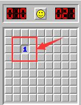

## 基于tkinter绘制9*9的棋盘模拟扫雷

### 0x00. 扫雷规则

  
   
这是一个10*10规模下的一局扫雷，当你在脸不黑的情况下点击一个格子时，会出现一个数字。  
这里我们假设数字为n，表示在这个数字周围的8个格子中，存在n个雷。
我们的任务就是在所有存在雷的地方插上旗子。
### 0x01. 雷的生成
首先，我们做的是扫雷游戏，相信学过Python基础的你一定对“雷的随机生成”、“棋盘的显示”在命令行(Terminial)中进行模拟游玩有自己的想法。  
这是这个项目的核心，其实就是维护一个二维数组，用数字来模拟雷的个数。
我们的棋盘是一个9*9的大小，雷用数字“9”表示，其余数字将基于规则显示周围雷的个数。   
雷的初始化在一个二维数组中如何去实现呢？我们可以使用random库中的randint()方法，在非0位置生成一个雷。

```python
import random
board = [[0 for j in range(9)] for i in range(9)]
for i in range(10):
    x = random.randint(0, 8)
    y = random.randint(0, 8)
    while board[x][y] != 0:
        x = random.randint(0, 8)
        y = random.randint(0, 8)
    board[x][y] = 9
```

### 0x02. 非“雷”格子的数字计算
根据扫雷的游戏规则，我们应当计算出格子周围8个里雷的个数。   
继之前我们在二维数组中初始化了10个雷，那么在非雷位置数字仍为零。   
你有什么办法来更新这个二维数组呢？嵌套循环！
```python
for i in range(9):
    for j in range(9):
        if board[i][j] == 0:
            number = 0
            # 利用循环，在当前格子的周围八个格子里“探雷”
            for s in [-1, 0, 1]:
                for t in [-1, 0, 1]:
                    # 0 <= i + s <= 8 and 0 <= j + t <= 8 两个条件是为了避免二维数组越界
                    if 0 <= i + s <= 8 and 0 <= j + t <= 8 and board[i + s][j + t] == 9:
                        number = number + 1
            board[i][j] = number
```   

### 0x03. 雷区的显示
我们可以把底层的数组看做后端，那么用tkinter与canvas创建的窗口和画布就我们的前端。   
出于这种考虑，我们还需要维护一个二维数组，用于为canvas提供数字，显示当前局面。
```python
show = [["-" for j in range(9)] for i in range(9)]
window = Tk()
canvas = Canvas(window, width=450, height=450)
canvas.pack()

canvas.delete(ALL)  # 每次显示前，我们会删除画布上的所有内容，根据底层的数组内容重新生成一遍
for i in range(1, 9):
    canvas.create_line(0, i * 50, 900, i * 50)  # 初始化横线
    canvas.create_line(i * 50, 0, i * 50, 900)  # 初始化竖线
for i in range(9):
    for j in range(9):
        x = j * 50 + 25
        y = i * 50 + 25
        canvas.create_text(x, y, text=show[i][j])  # 显示当前棋盘
```

### 0x04. 鼠标点击事件
对这个游戏而言，操作只有左键踩格子、右键插旗这两种动作。   
为了处理这两个动作，我们会利用```canvas.bind_all()```来绑定左右键对应的处理函数。    
首先,我们需要了解鼠标点击后canvas画布后，我们能得到什么信息？我们先来看看绑定右键的函数是什么样的。

```python
def mark(event):
    relu = [" "] + [str(i) for i in range(1, 8)]
    x = event.y // 50
    y = event.x // 50
    if show[x][y] == "-":
        show[x][y] = "F"
    elif show[x][y] == "F":
        show[x][y] = "?"
    elif show[x][y] == "?":
        show[x][y] = "-"
    elif show[x][y] in relu:
        show[x][y] = show[x][y]
    showBoard()
...
...
canvas.bind_all("<Button-3>", mark)
```
我们从event参数中，能得到鼠标在画布上的坐标位置。利用这个信息，我们可以对应修改我们的数组，模拟插旗、打问号、还原。   
对于左键逻辑的处理，我们仍然可以利用类似的方法，但处理逻辑上可能会相对复杂。
```python
# 初始化click事件处理逻辑
def click(event):
    # 在鼠标点击后，我们会先使用局部变量x,y记录鼠标点击窗口的位置，然后进行判赢逻辑检查
    # click中的event属性包含点击窗口的坐标位置，我们会利用这个值，做数组修改或数据判断
    x = event.y // 50
    y = event.x // 50

    # 判断获胜条件：检查show数组中"-"、“F”、“?”三者的个数，即可判赢（是否存在bug？）
    if sum([row.count("-") for row in show]) == 0 \
            and sum([row.count("F") for row in show]) == 9 \
            and sum([row.count("?") for row in show]) == 0:
        showinfo("WIN", "You Win!")
        # 判断结束，通知结束，窗口摧毁
        window.destroy()
    elif board[x][y] == 9:
        showinfo("LOSE", "BOMB! You Lose!")
        # 判断结束，通知结束，窗口摧毁
        window.destroy()
    # 如果无输赢情况，则要修改棋盘当前显示的局面，核心是更新底层的show数组
    else:
        # 这里我们分两种情况
        # 1. 点击处为0（即周围8个格子不存在雷），则消除在整个棋盘上所有为0的格子，并显示其周围8个格子的情况，形成一个“非雷区闭包”
        if board[x][y] == 0:
            for i in range(9):
                for j in range(9):
                    if board[i][j] == 0:
                        for s in [-1, 0, 1]:
                            for t in [-1, 0, 1]:
                                if 0 <= i + s <= 8 and 0 <= j + t <= 8:
                                    if board[i + s][j + t] > 0:
                                        show[i + s][j + t] = str(board[i + s][j + t])
                                    else:
                                        show[i + s][j + t] = " "
        # 2. 点击处周围8个格子存在雷，则显示当前格子的数字
        else:
            show[x][y] = str(board[x][y])
    showBoard()
...
...
canvas.bind_all("<Button-1>", click)
```
至此，针对这个扫雷游戏的逻辑解释基本完成，我们只需将上述的逻辑封装成函数，即可畅玩。