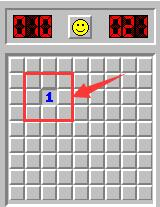
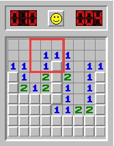

## 基于tkinter绘制9*9的棋盘模拟扫雷

### 0x00. 扫雷规则

  
   
         这是一个10*10规模下的一局扫雷，当你在脸不黑的情况下点击一个格子时，会出现一个数字，
     这里我们假设数字为n,表示在这个数字周围的8个格子中，存在n个雷。
     

    
         如果你正好点到一个数字为0的格子，会以这个格子向四周扩散，直到形成一个都存在数字的
     一个“闭环”。那么在上图中，了解了扫雷的规则，我们很容易就能推断出雷就在左下角的空格中。   
### 0x01. 雷的生成
        首先，我们做的是扫雷游戏，相信学过Python基础的你一定对“雷的随机生成”、“棋盘的显示”
    在命令行(Terminial)中进行模拟游玩有自己的想法，这是这个项目的核心，其实就是维护一个二维
    数组，用数字来模拟雷的个数。
        我们的棋盘是一个9*9的大小，雷用数字“9”表示，其余数字将基于规则显示周围雷的个数。
        雷的初始化在一个二维数组中如何去实现呢？我们可以使用random库中的randint()方法，在非
    0位置生成一个雷。

```python
import random
board = [[0 for j in range(9)] for i in range(9)]
for i in range(10):
    x = random.randint(0, 8)
    y = random.randint(0, 8)
    while board[x][y] != 0:
        x = random.randint(0, 8)
        y = random.randint(0, 8)
    board[x][y] = 9
```

### 0x02. 非“雷”格子的数字计算
        根据扫雷的游戏规则，我们应当计算出格子周围8个里雷的个数。继之前我们在二维数组中初始化
    了10个雷，那么在非雷位置数字仍为零。你有什么办法来更新这个二维数组呢？嵌套循环！
```python
for i in range(9):
    for j in range(9):
        if board[i][j] == 0:
            number = 0
            # 利用循环，在当前格子的周围八个格子里“探雷”
            for s in [-1, 0, 1]:
                for t in [-1, 0, 1]:
                    # 0 <= i + s <= 8 and 0 <= j + t <= 8 两个条件是为了避免二维数组越界
                    if 0 <= i + s <= 8 and 0 <= j + t <= 8 and board[i + s][j + t] == 9:
                        number = number + 1
            board[i][j] = number
```   

### 0x03. 棋盘的显示
       我们可以把底层的数组看做后端，那么用tkinter与canvas创建的窗口和画布就我们的前端。